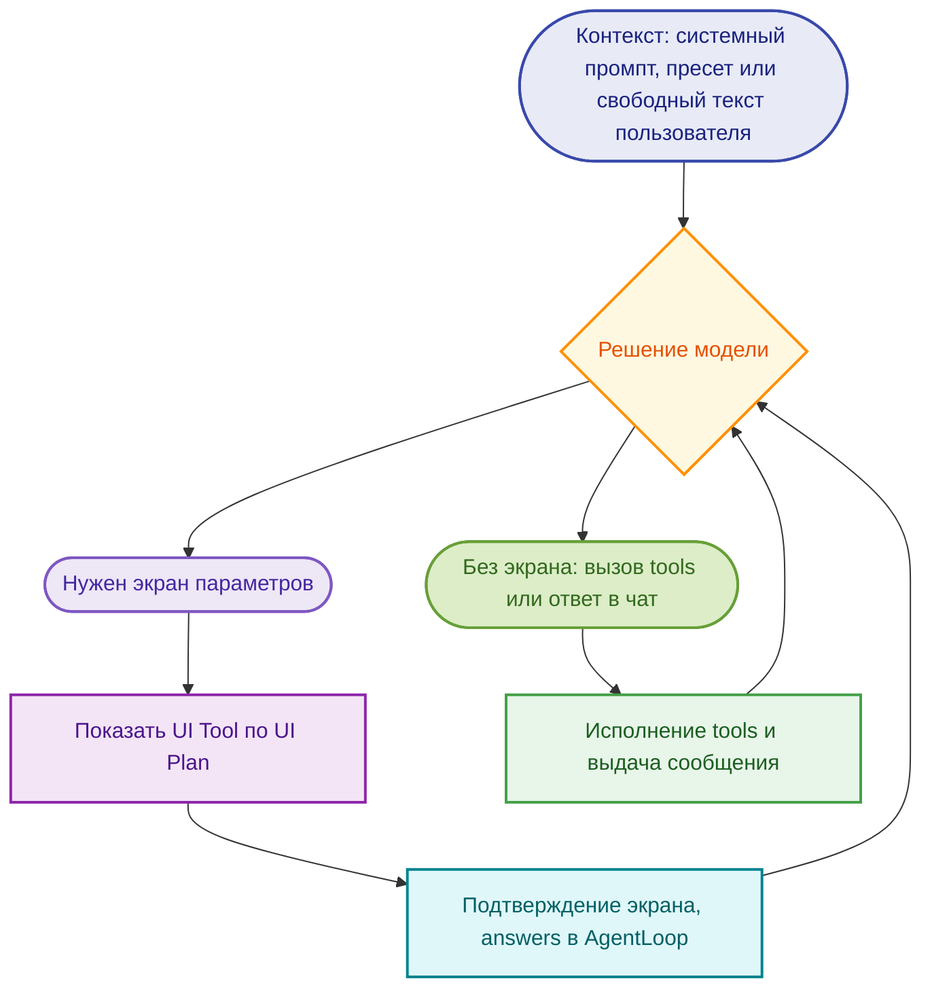

<!-- cspell:disable -->

# 🪄 Interactive UI-Orchestrated LLM

## ✨ Продукт: слоган и образ

**📣 Слоганы** (черновики):

- 🎯 «От запроса к результату — без бесконечного чата»
- ✨ «Сначала ясность — потом магия»
- 🧭 «Один замысел — понятный путь»
- 📋 «Форма вместо переписки»
- 🪜 «Скажи, что нужно — уточним через форму»

**🪄 Иконка — волшебная палочка.** Визуальный символ продукта — **палочка волшебника**: она передаёт идею **превращения
намерения в готовый результат** — 📝 текст, 🖼️ картинку, 📊 диаграмму — без длинных ритуалов в чате. Это не «магия
вслепую», а **направленное действие**: палочка срабатывает, когда намерение уже сопровождено **ясностью деталей** —
через **UI Tool** и **UI Plan**, выбор **tools** и цикл **AgentLoop** (как в сказке — ✨ слова заклинания задают
направление, остальное помогает дорисовать картину). Для интерфейса это задаёт образ: **лёгкий жест — осмысленный итог**
✅

> **🏷️ Рабочее название:** «Диалог как форма» · **системные промпты агента + AgentLoop + tools (решение модели)**

---

## 📌 TL;DR

- 🤖 Агент передаёт модели **системные промпты** (роль, домен, как работать с формой и инструментами). Модель в
  **AgentLoop** **сама решает**, что делать дальше: нужен ли **UI Tool** (экран параметров), какие ещё **tools** вызвать
  и в каком порядке — **никакого жёсткого сценария** «сначала всегда UI, потом всегда генерация» мы модели не
  навязываем.
- 🧭 **Пресет и свободный режим** отличаются **только составом пользовательского контекста относительно системного
  промпта**:  
  **пресет** — к контексту добавляется **промпт пресета**; **свободный** — **текст пользователя**. Один и тот же
  механизм агента, контракт UI и набор tools.
- ⚙️ **Ядро** — агент с системными промптами и **AgentLoop** с **tools**. Важный инструмент — **UI Tool** (экран выбора
  параметров, кнопка **«Продолжить»** / **«Сгенерировать»** — вариант копирайта); вызывать его или обойтись без него
  решает **модель**, исходя из цели и инструкций.
- 🔧 Примеры прочих tools — генерация изображения, векторизация в SVG, конвертация текста в PDF, генерация аудио/видео и
  т.д.
- 🎙️ **Голосовой режим** и ASR вынесены в **отдельный раздел**; в остальном документе голос не дублируется.

---

## 📖 Глоссарий

Ниже — **термины**, которые дальше по документу используются в этих значениях.

| Термин                     | Описание                                                                                                                                                                                         |
| -------------------------- | ------------------------------------------------------------------------------------------------------------------------------------------------------------------------------------------------ |
| **UI Plan**                | Декларативное описание **одного экрана параметров**: заголовок, пояснение, массив `fields` с типами (**Field kind**), подписями и ограничениями; то, что модель передаёт при вызове **UI Tool**. |
| **Field kind**             | Тип элемента формы в **UI Plan**: например `text`, `textarea`, `number`, `tabs_single`, `tabs_multi`, `toggle`, `color`, `file`, `chart_series`.                                                 |
| **UI Tool**                | Инструмент агента: показать пользователю экран по **UI Plan**, принять ввод, по подтверждению вернуть **`answers`** в **AgentLoop**.                                                             |
| **AgentLoop**              | Цикл агента: рассуждение модели → вызовы **tools** (и при необходимости **UI Tool**) → подстановка результатов в контекст → следующий ход.                                                       |
| **Tool**                   | Именованная операция среды: генерация изображения, PDF, векторизация, рендер диаграммы по spec и т.п.                                                                                            |
| **Artifact**               | Промежуточные данные для рендера UI (не обязательно видимые как отдельный экран), напр. `palette_candidates` для выбора палитры.                                                                 |
| **`answers`**              | Собранное **состояние ответов** по `id` полей после нажатия «Продолжить» / «Сгенерировать» на экране **UI Tool**.                                                                                |
| **Mode preset** (`modeId`) | Выбор на **стартовом экране**: идентификатор пресета; в контекст агента добавляется промпт пресета (см. раздел про пресеты).                                                                     |
| **Free mode**              | Режим без пресета: в контекст к системному промпту добавляется **текст намерения** пользователя.                                                                                                 |
| **Voice adapter**          | Слой «речь ↔ значения полей»: ASR, сопоставление с **Field kind** и опциями, опционально TTS.                                                                                                    |

---

## 💡 Идея

Продукт строится вокруг простой мысли: **намерение пользователя** и **ясные параметры** лучше соединять не бесконечной
перепиской в чате, а там, где уместно — **структурированным экраном** с типизированными полями. При этом **ни порядок
шагов, ни обязательность формы** снаружи не задаются: ими управляет **модель** внутри обычного **AgentLoop**, опираясь
на системные промпты и доступные **tools**.

### 🎯 Суть

- **Агент** задаёт модели **системные промпты**: роль, домен, как вызывать инструменты, как интерпретировать
  **`answers`** с экрана параметров.
- В **AgentLoop** модель **сама решает** следующий ход: показать **UI Tool**, вызвать генерацию, цепочку **tools** или
  ответить текстом — в зависимости от задачи и инструкций. **Фиксированного сценария** «всегда сначала форма, потом
  генерация» нет.
- **UI Tool** — это **один из tools** (не отдельный «обязательный этап пайплайна»). Он исполняет **UI Plan** (см.
  **глоссарий**): клиент строит **декларативный интерфейс** по декларации полей (**Field kind**), пользователь
  подтверждает ввод — в цикл возвращаются **`answers`** по `id` полей.

### 🧩 Как это собирается вместе

| Блок                     | Роль                                                                                                                                 |
| ------------------------ | ------------------------------------------------------------------------------------------------------------------------------------ |
| 🧠 **Системные промпты** | Задают рамку: доступные **tools**, ожидаемые форматы, работа с **UI Plan** и **`answers`**.                                          |
| 🔁 **AgentLoop**         | Повторяющийся цикл: рассуждение модели → вызовы **tools** (в т.ч. **UI Tool**) → подстановка результатов в контекст → следующий ход. |
| 📱 **UI Tool + UI Plan** | При вызове — экран параметров; после подтверждения в цикл возвращаются **`answers`**.                                                |
| 🛠️ **Прочие tools**      | Генерация изображения, PDF, векторизация, рендер диаграммы по spec и т.д. — наравне с **UI Tool**, по решению модели.                |

Детали проводки цикла и контрактов — в разделе **«🏗️ Архитектура: агент и AgentLoop»**.

### 🔄 Иллюстративная цепочка (не жёсткий протокол)

Ниже — **схема для человека**, а не инструкция исполнителю. По **AgentLoop** после **любого** tool (включая возврат
**`answers`** с экрана) результат попадает в контекст и снова принимает решение **модель** — поэтому стрелки
**возвращаются к «Решению модели»**. Остановка диалога, ошибки и ветвления без UI **на схеме не развернуты**.



На практике **модель** сама выбирает, сколько раз вызывать **UI Tool**, обходить ли экран параметров и в каком порядке
смешивать **tools** — схема показывает только две типичные ветки из узла **«Решение модели»**.

---

## 🧭 Пресет и свободный режим

Оба режима используют **один и тот же** AgentLoop, контракт UI и набор tools.

| Режим         | Как в контекст попадает пользовательская часть (к системному промпту) |
| ------------- | --------------------------------------------------------------------- |
| **Пресет**    | `<системный промпт>` + `<промпт из пресета>`                          |
| **Свободный** | `<системный промпт>` + `<промпт от пользователя>`                     |

Пресет задаёт **готовый текст намерения и фокус**, свободный режим — **произвольное намерение**; дальше работает **тот
же** агент и те же tools — **как именно** модель их использует, решает она.

### 🏠 Стартовый экран

Пользователь выбирает **Mode preset** (`modeId`) или **Free mode**. Это влияет на **фрагмент контекста**, который вместе
с системным промптом попадает в **AgentLoop** (см. таблицу выше и глоссарий). Реальные идентификаторы и формулировки
фиксируются в коде и локалях.

### 📚 Каталог пресетов (ориентир)

Ниже — ориентир для продукта; состав каталога расширяемый.

| Группа                 | Примеры задач (`modeId` — ориентир)                                                | Зачем пользователю                                      |
| ---------------------- | ---------------------------------------------------------------------------------- | ------------------------------------------------------- |
| 📝 Текст               | Улучшение текста; краткое содержание; пересказ; черновик письма / email            | Повседневная редактура и коммуникация                   |
| 💌 Поздравления        | Поздравление с адресатом и поводом (семья, друг, коллега; праздник, юбилей и т.д.) | Тон, длина, обращение без выдумывания структуры с нуля  |
| 💼 Идеи и бизнес       | Бизнес-идея; идеи поста / заголовки; FAQ, ответы на возражения                     | Структура без промпт-инженерии                          |
| 📅 Выступления и планы | Тезисы выступления; повестка встречи; чек-лист из цели                             | Каркас под время и формат                               |
| 🎨 Визуал и вектор     | SVG-иконка; логотип; аватарка                                                      | Растр при необходимости → векторизация (например в SVG) |
| 📊 Данные и схемы      | Диаграмма (столбцы, круг, линия); таблица из текста                                | Числа и подписи → spec или SVG                          |

Дополнительно по продукту: резюме вакансии, объявление, текст лендинга — тот же механизм пресетов.

### 🎯 Паритет качества

**Продуктовая цель:** для **одного и того же класса задач** (та же диаграмма, тот же тип иконки, сходный сценарий
текста) результат в **свободном** режиме **не должен уступать** по смыслу и полезности результату с **пресетом** — по
полноте учтённых параметров и качеству артефакта. Пресет задаёт **эталонный фокус** и удобный вход; свободный режим
опирается на **тот же** AgentLoop и **те же** tools — без статуса «упрощённой версии».

### ⚖️ Смысл режимов для пользователя

| Аспект     | 📦 Пресет                                             | 🆓 Свободный                                       |
| ---------- | ----------------------------------------------------- | -------------------------------------------------- |
| Назначение | Быстрый старт, понятный сценарий, предсказуемый фокус | Любая формулировка цели одной точкой входа         |
| Контекст   | + готовый **промпт пресета**                          | + **текст пользователя**                           |
| Поведение  | Меньше «разведки» намерения — контекст уже сужен      | Больше свободы формулировки задачи                 |
| UX         | Ниже когнитивная нагрузка «что выбрать»               | Выше гибкость, слабее заранее заданное направление |

Оба варианта — **один контракт** UI и tools; пресет **сужает** контекст и ускоряет старт, а не меняет механику агента.

### 🏷️ Роль пресета в продукте

**Пресет** — это не инструкция модели «идти только таким путём». Это **наш** продуктовый слой: **готовые формулировки
намерения**, фокус задачи, при необходимости **дополнительные текстовые заготовки** под домен. Модель по-прежнему
**сама** решает, вызывать ли UI Tool и какие tools применять; пресет помогает **пользователю** быстрее попасть в нужный
контекст.

---

## 🏗️ Архитектура: агент и AgentLoop

**Ядро продукта** — **агент**, который:

- передаёт модели **системные промпты**: роль, домен, ограничения, формат ответов, **как пользоваться tools** (включая
  UI Tool), что считать успешным исходом;
- крутит **AgentLoop** — как в обычном агентском цикле: модель возвращает рассуждение и/или **вызовы инструментов**,
  среда исполняет tools и подкладывает результаты в следующий ход.

**Модель не получает инструкции вида «обязательно сначала A, потом B».** Она видит доступные tools и правила в системных
промптах и **сама решает**, нужен ли UI Tool в данном диалоге, сколько раз вызывать генерацию, можно ли обойтись без
формы и т.д. Агент лишь обеспечивает контракт исполнения (аргументы tool, рендер UI, возврат `answers` в цикл).

### UI Tool (важный, но не обязательный на каждом шаге)

**UI Tool** — показ экрана **выбора параметров**: клиент отображает **форму** по декларации и кнопку **«Продолжить»** /
**«Сгенерировать»**. После нажатия пользователем в контекст возвращаются **`answers`**; **дальше снова решает модель** —
продолжить теми же tools, вызвать генерацию, снова показать форму и т.п.

Детали элементов UI — в разделе **«UI Tool: элементы интерфейса»**.

### Примеры прочих tools

- генерация изображения по согласованным полям;
- векторизация изображения в SVG;
- конвертация текста в PDF;
- генерация аудио / видео;
- отрисовка диаграммы по spec (Vega-Lite, SVG и т.п.);
- любые доменные действия с явным контрактом аргументов.

---

## 📋 UI Tool: элементы интерфейса

В **UI Plan** модель описывает экран как **форму с подписями** (`label`) у каждого поля — как в обычной анкете. У
каждого поля — **Field kind** из whitelist на клиенте.

### Текстовый ввод

- **`text`** — одна строка; **`textarea`** — много строк.
- В **реализации** текстовых полей предусмотрен **голосовой ввод с транскрибацией** (подробности — в разделе
  **«Голосовой режим»**, без дублирования здесь).

### Числа и переключатели

- **`number`** — число (при необходимости `min` / `max` в ограничениях).
- **`toggle`** — да/нет для одного флага.

### Выбор вариантов: вкладки, не выпадающие списки

Вместо **Select** (выпадающего списка) используются **вкладки**:

- **`tabs_single`** — ровно один выбранный вариант из набора (аналог radio + визуально табы).
- **`tabs_multi`** — несколько вариантов (аналог чекбоксов по вариантам, но в UI — группа вкладок с множественным
  выбором).

У каждого варианта — **`id`**, **`label`**, опционально **иконка/превью** (например для палитры). В **UI Plan** опции
могут подставляться из **`artifacts`** (см. **Artifact** в глоссарии), например `palette_candidates`.

### Цвет и файлы

- **`color`** — выбор цвета, при необходимости с привязкой к теме.
- **`file`** — загрузка файла (референсы, CSV, вложения).

### Составные блоки

- **`chart_series`** или аналог — табличный ввод рядов данных, если домену нужен структурированный ввод нескольких
  колонок.

### Кнопка подтверждения

На экране UI Tool одна главная кнопка: по нажатию клиент отправляет **`answers`** обратно в **AgentLoop**; **какой
следующий шаг** (какие tools, нужен ли ещё UI) определяет **модель**, а не жёсткая схема «после формы всегда X». Подпись
— **«Продолжить»** или **«Сгенерировать»** (продуктовый выбор).

### Минимальный пример фрагмента схемы (идея)

```json
{
  "title": "Параметры графика",
  "fields": [
    {
      "id": "chart_type",
      "label": "Тип диаграммы",
      "kind": "tabs_single",
      "options": [
        { "id": "bar", "label": "Столбцы" },
        { "id": "line", "label": "Линия" }
      ]
    },
    {
      "id": "palette",
      "label": "Палитра",
      "kind": "tabs_single",
      "optionsFrom": "palette_candidates"
    },
    {
      "id": "notes",
      "label": "Комментарий",
      "kind": "textarea"
    }
  ]
}
```

Полный контракт **UI Plan** фиксируется **JSON Schema** в репозитории; неизвестный **Field kind** — отбраковка или
безопасный fallback на клиенте.

---

## 🎙️ Голосовой режим

В этом разделе собрано всё про **ASR (распознавание речи)**, **Voice adapter** (см. глоссарий) и адаптацию UX. В
остальных разделах голос **не повторяется**.

### Идея

В приложении можно включить **режим работы голосом**: интерфейс и сценарии **подстраиваются** — крупнее подсказки, явный
индикатор записи, удобное переключение микрофона, озвучка шагов (TTS) по желанию продукта. **Voice adapter**
сопоставляет транскрипт с полями **UI Plan** и **Field kind**.

### Пример сценария (не протокол)

Иллюстрация того, как **может** выглядеть работа в голосовом режиме; порядок и необходимость UI Tool по-прежнему
определяет **модель** в AgentLoop.

1. **Стартовый экран** — пользователь **называет голосом** имя пресета или свободный режим; ASR → текст в сессию.
2. **Намерение** — пользователь **диктует** задачу; контекст формируется как в разделе про пресет / свободный режим.
3. **Если модель вызвала UI Tool** — пользователь **голосом выбирает** значения по подписям полей (_«Стиль — три дэ»_,
   _«Палитра — золотистая»_). Клиент маппит речь на **`tabs_single` / `tabs_multi`**, **`toggle`**, поля ввода —
   правилами, fuzzy и при необходимости коротким вызовом LLM.
4. **Подтверждение** — фраза **«Продолжи»** / **«Сгенерируй»** или кнопка; **`answers`** возвращаются в цикл, дальше
   снова **решение модели**.

### Текстовые поля и голос

В реализации полей **`text`** / **`textarea`** голосовой ввод с транскрибацией — **основной способ** заполнения в
голосовом режиме; результат ASR подставляется в поле с возможной лёгкой нормализацией пробелов и пунктуации.

---

## 🗨️ UX: главный экран, чат и история

### 🏠 Главный экран → чат

- **Старт:** пользователь видит **каталог пресетов** и пункт **«Свободный»** — не пустое поле без контекста, а
  осмысленный выбор задачи.
- **После выбора** открывается **одна лента**: сообщения, экраны UI Tool, превью и результаты генерации.
- **Главный экран** — точка выбора режима (`modeId` и пользовательский слой); дальше человек остаётся в **непрерывном
  чате** с полной историей, без обязательного «прыжка» в отдельные несвязанные экраны без ленты.

### 💾 История на сервере

История **целиком** на **сервере**: текст, структурированные ответы по полям, сгенерированный UI, **медиа и вложения**.
При повторном открытии восстанавливаются и смысл, и артефакты.

**Смена пресета** не обязана обнулять ленту — политика продукта; принцип: **одна общая история** взаимодействий, без
принудительного «чистого листа» при смене режима.

---

## 🤖 Модели и пакет `ai`

В репозитории — общий пакет **`ai`**: абстракция над LLM и генерацией изображений, **structured output** (JSON по схеме
UI), валидация и при необходимости repair, вызовы генераторов изображений и других backend-операций. Приложение **не
привязано** к одному вендору: выбор — через конфиг.

### Режимы: разработка и продакшен

| Режим    | Источник моделей                                                                         | Назначение                                                                                |
| -------- | ---------------------------------------------------------------------------------------- | ----------------------------------------------------------------------------------------- |
| **Dev**  | **Ollama** (локально)                                                                    | Быстрые итерации без облачных ключей; те же интерфейсы пакета `ai`, что в проде.          |
| **Prod** | Провайдеры с HTTP API, совместимые с OpenAI Chat Completions / Images там, где применимо | Любые поддерживаемые бэкенды; модели и ключи — из конфигурации окружения, не из кода фич. |

**Идея:** один контракт в коде (текст + structured output + генерация изображений), **две реализации** адаптера —
например `ollama` для dev и `openai_compatible` для продакшена с `baseURL` и моделями из конфига.

### 🦙 Ollama: ориентир для разработки (например RTX 3060, 12 ГБ VRAM)

Нужны модели, которые **умещаются в VRAM** без постоянных OOM и дают приемлемую скорость итераций. Имена тегов уточняйте
в каталоге Ollama (`ollama list`); при нехватке памяти можно сменить квантизацию.

**Текст и оркестрация** (инструкции, JSON UI):

| Модель (Ollama)   | Когда уместна                                                                                                                                         |
| ----------------- | ----------------------------------------------------------------------------------------------------------------------------------------------------- |
| **`qwen2.5:7b`**  | Удобный **дефолт**: следование инструкциям и структурированному выводу, **многоязычность** (в т.ч. русский в промптах); 7B на 12 ГБ обычно с запасом. |
| **`llama3.1:8b`** | Альтернатива Meta: предсказуемый общий чат и инструкции; удобна, если команда привыкла к Llama.                                                       |
| **`qwen2.5:3b`**  | Лёгкий вариант: быстрее итерации и меньше VRAM; качество сложной схемы UI может быть слабее — компромисс скорость/качество.                           |

**Генерация изображений:**

| Модель (Ollama)     | Когда уместна                                                                                                      |
| ------------------- | ------------------------------------------------------------------------------------------------------------------ |
| **`flux:schnell`**  | Баланс качества и скорости в линейке **Flux**; удобный **дефолт** для старта в Ollama.                             |
| **`z-image-turbo`** | Упор на **скорость** и VRAM; заметна на задачах с **текстом на изображении** (латиница и др.).                     |
| **`sdxl`**          | Запасной вариант: предсказуемое поведение и широкая база рецептов, если другие модели дают OOM или нестабильность. |

Пример локальной подготовки:

```bash
# текст / оркестрация (достаточно одной модели по выбору):
ollama pull qwen2.5:7b

# изображения (достаточно одной модели по выбору):
ollama pull flux:schnell
```

### 🇷🇺 Российские провайдеры (прод и тесты, оплата в рублях)

OpenAI-совместимый API (`baseURL` + ключ), без привязки к одному вендору в коде:

- **[AITUNNEL](https://aitunnel.ru/)** — единая точка `https://api.aitunnel.ru/v1/`, Chat Completions, картинки,
  embeddings; в документации — баланс, статистика, `max_tokens`.
- **[ProxyAPI](https://proxyapi.ru/)** — доступ к OpenAI-совместимым API без VPN, оплата в рублях.
- **[ProxyAPI OpenRouter](https://proxyapi.ru/openrouter)** — каталог моделей **OpenRouter** через тот же подход.

Пакет `ai` хардкодит только **конфиг** (endpoint, ключ, идентификаторы моделей), чтобы переключаться между Ollama,
AITUNNEL, ProxyAPI и другими совместимыми шлюзами.

---

## 🌊 Потоки (примеры)

Ниже — **примеры сценариев** в одной структуре. Это **иллюстрации**, не жёсткий протокол: модель сама решает, вызывать
ли **UI Tool**, что положить в **UI Plan**, сколько раз вызывать tools и в каком порядке.

Во всех таблицах ниже **одни и те же шесть шагов** (термины — в **глоссарии**):

1. **Намерение** — типичный запрос пользователя.
2. **Контекст** — **Mode preset** или **Free mode**.
3. **UI Plan** — какие поля модель _может_ показать (**Field kind**).
4. **Подтверждение** — одна механика для всех сценариев: пользователь подтверждает экран (**«Продолжить»** /
   **«Сгенерировать»** — варианты копирайта); клиент возвращает в **AgentLoop** **`answers`** — значения по `id` полей
   **UI Plan**. От сценария к сценарию меняется только **набор полей** в шаге 3, не правило подтверждения.
5. **Дальше** — что делает цикл **после** появления **`answers`** (вызовы **tools**, ответ модели).
6. **Иначе** — когда модель может упростить путь: меньше полей, другой порядок, обход **UI Tool** и т.д.

---

### 📊 Диаграмма / график

| Шаг               | Содержание                                                                                                                                                                                                                                                                                                                                                                                                                               |
| ----------------- | ---------------------------------------------------------------------------------------------------------------------------------------------------------------------------------------------------------------------------------------------------------------------------------------------------------------------------------------------------------------------------------------------------------------------------------------- |
| **Намерение**     | _«Столбчатый график выручки по кварталам»_; та же задача круговой или линейной диаграммой по тем же данным.                                                                                                                                                                                                                                                                                                                              |
| **Контекст**      | Пресет «диаграмма» или **Free mode** (намерение — в тексте пользователя).                                                                                                                                                                                                                                                                                                                                                                |
| **UI Plan**       | Заголовок (**`text`**); подписи оси X и значения (**`textarea`** или **`chart_series`**); тип (**`tabs_single`**: столбцы, круг, линия…); при необходимости единицы (**`text`**); палитра из **`artifacts`** (**`palette_candidates`**) — **`tabs_single`** с превью. По продукту — и другие поля визуала (стиль, фотореализм, назначение **иконка** / **иллюстрация** и т.д.). Всё может уместиться **в одном** **UI Plan**.            |
| **Подтверждение** | Пользователь подтверждает экран (**«Продолжить»** / **«Сгенерировать»**); в **AgentLoop** передаются **`answers`** по `id` полей **UI Plan**.                                                                                                                                                                                                                                                                                            |
| **Дальше**        | Вызов tool рендера диаграммы: например **`chart_spec`** (Vega-Lite и аналоги), готовый **SVG** или иной тип результата (3D-bar и т.п.); **клиент** строит **читаемую data-визуализацию** по spec/данным. В метаданных tool — явные `name` / `args` и тип результата, чтобы маршрутизировать **движок диаграмм** и не дублировать логику формы на клиенте. **Не путать** с растровой «картинкой графика», если нужна диаграмма по данным. |
| **Иначе**         | Уточнение в чате, **меньше** полей на экране или **другой** порядок tools. Растр, **иконка → SVG** и отличие от покадровой «фото»-генерации для иконок — в примерах **«SVG иконка»**, **«SVG логотип»**.                                                                                                                                                                                                                                 |

---

### 💌 Поздравление

| Шаг               | Содержание                                                                                                                                                                                                                                                                                     |
| ----------------- | ---------------------------------------------------------------------------------------------------------------------------------------------------------------------------------------------------------------------------------------------------------------------------------------------- |
| **Намерение**     | _«Сгенерируй поздравление для друга»_.                                                                                                                                                                                                                                                         |
| **Контекст**      | Пресет «поздравление» или **Free mode**.                                                                                                                                                                                                                                                       |
| **UI Plan**       | Имя адресата (**`text`**); возраст или повод (**`number`** / **`text`**); тон (**`tabs_single`**: шутливый / нейтральный / деловой / трогательный); эмодзи (**`toggle`**); длина (**`tabs_single`**: коротко / средне / развёрнуто); оформление (**`tabs_multi`**: абзацы, список, заголовок). |
| **Подтверждение** | Пользователь подтверждает экран (**«Продолжить»** / **«Сгенерировать»**); в **AgentLoop** передаются **`answers`** по `id` полей **UI Plan**.                                                                                                                                                  |
| **Дальше**        | **LLM** или доменный tool текста: финальный промпт из намерения и **`answers`** → результат, чаще всего **Markdown**.                                                                                                                                                                          |
| **Иначе**         | Параметры частично уже в **истории** чата — модель может **не** вывести все поля или сократить экран.                                                                                                                                                                                          |

---

### 📝 Улучшение текста

| Шаг               | Содержание                                                                                                                                                                                                                                                                                                                                                                                                        |
| ----------------- | ----------------------------------------------------------------------------------------------------------------------------------------------------------------------------------------------------------------------------------------------------------------------------------------------------------------------------------------------------------------------------------------------------------------- |
| **Намерение**     | _«Сделай текст яснее и короче»_; _«Приведи к деловому стилю»_.                                                                                                                                                                                                                                                                                                                                                    |
| **Контекст**      | Пресет «улучшение текста» или **Free mode**.                                                                                                                                                                                                                                                                                                                                                                      |
| **UI Plan**       | Исходный текст (**`textarea`**, обязательное поле); цель правки (**`tabs_single`** или **`tabs_multi`**: сократить / сохранить объём / расширить; упростить формулировки; деловой / нейтральный / дружелюбный тон); опционально аудитория (**`text`**); эмодзи (**`toggle`**); формат результата (**`tabs_multi`**: абзацы, список, заголовки). При необходимости — **`file`**, если исходник только во вложении. |
| **Подтверждение** | Пользователь подтверждает экран (**«Продолжить»** / **«Сгенерировать»**); в **AgentLoop** передаются **`answers`** по `id` полей **UI Plan**.                                                                                                                                                                                                                                                                     |
| **Дальше**        | **LLM** (и при необходимости tool вроде экспорта в PDF) → улучшенный текст, обычно **Markdown** или согласованный формат.                                                                                                                                                                                                                                                                                         |
| **Иначе**         | Короткий запрос: ответ **без** **UI Tool** или экран с **одним** полем («вставь текст») — по политике в системном промпте.                                                                                                                                                                                                                                                                                        |

---

### 🖼️ SVG иконка

| Шаг               | Содержание                                                                                                                                                                                                                                                                                                                                                       |
| ----------------- | ---------------------------------------------------------------------------------------------------------------------------------------------------------------------------------------------------------------------------------------------------------------------------------------------------------------------------------------------------------------- |
| **Намерение**     | _«Иконка кота для приложения, потом в SVG»_; пресет «иконка / вектор».                                                                                                                                                                                                                                                                                           |
| **Контекст**      | Пресет визуала или **Free mode**.                                                                                                                                                                                                                                                                                                                                |
| **UI Plan**       | Описание сцены (**`textarea`**); стиль (**`tabs_single`**); палитра (**`artifacts`** + **`tabs_single`**), часто **монохром** или мало цветов для читаемой трассировки; назначение «иконка / иллюстрация» (**`tabs_single`**); при необходимости размер или фон (**`text`** / **`color`**).                                                                      |
| **Подтверждение** | Пользователь подтверждает экран (**«Продолжить»** / **«Сгенерировать»**); в **AgentLoop** передаются **`answers`** по `id` полей **UI Plan**.                                                                                                                                                                                                                    |
| **Дальше**        | **Tool** генерации **растра** по **`answers`** → **tool** **векторизации** в **SVG** (клиент или сервер — по продукту), типично для **контрастного** растра, удобного для контура → **SVG** в ленту или скачивание. Это **не** путь **data**-диаграммы — см. **Дальше** в **«Диаграмма по данным»**. Цветной знак с плавными переходами — см. **«SVG логотип»**. |
| **Иначе**         | Только растр без векторизации, если вектор не нужен или сценарий его исключает.                                                                                                                                                                                                                                                                                  |

---

### 🎨 SVG логотип

| Шаг               | Содержание                                                                                                                                                                                                                                                                                                                                                                                                      |
| ----------------- | --------------------------------------------------------------------------------------------------------------------------------------------------------------------------------------------------------------------------------------------------------------------------------------------------------------------------------------------------------------------------------------------------------------- |
| **Намерение**     | _«Логотип для кофейни, фирменные цвета, выдать в SVG»_; пресет «логотип / бренд».                                                                                                                                                                                                                                                                                                                               |
| **Контекст**      | Пресет визуала или **Free mode**.                                                                                                                                                                                                                                                                                                                                                                               |
| **UI Plan**       | Название или слоган (**`text`**); описание характера бренда (**`textarea`**); **цветовая палитра** — **`artifacts`**, **`color`**, **`tabs_single`** / **`tabs_multi`** (фирменные цвета, градиенты по продукту); композиция (**`tabs_single`**: знак отдельно / знак + текст); стиль (**`tabs_single`**); при необходимости формат вывода (**`text`**: горизонтальная версия и т.д.).                          |
| **Подтверждение** | Пользователь подтверждает экран (**«Продолжить»** / **«Сгенерировать»**); в **AgentLoop** передаются **`answers`** по `id` полей **UI Plan**.                                                                                                                                                                                                                                                                   |
| **Дальше**        | **Tool** генерации **цветного растра** по **`answers`** → **tool** **векторизации** с **поддержкой цвета** (не только монохромный контур) или иной путь в **SVG** по продукту (в т.ч. прямой вывод вектора без промежуточного «плоского» растра) → **SVG** в ленту или скачивание. От **data**-диаграммы — по-прежнему см. **«Диаграмма по данным»**. Упрощённая **монохромная** иконка — см. **«SVG иконка»**. |
| **Иначе**         | Только растр или PNG; упрощение до одноцветного знака — тогда ближе сценарий **«SVG иконка»**.                                                                                                                                                                                                                                                                                                                  |

---

### 🧩 Общий принцип

- **Один** **UI Plan** может объединять **много полей** — решает модель, не внешний сценарий «шаг за шагом».
- Повторный **UI Tool** с **другим** **UI Plan** (уточнение) — допустим в **AgentLoop**.
- Состояние: **`answers`** по `id` и **история** сообщений; дальше — с учётом выходов **tools**.

---

## 🔮 Идеи на будущее

Ниже — **направления развития**, а не требования к текущему релизу. Общая рамка та же: **системные промпты**,
**AgentLoop**, **tools**, при необходимости **UI Tool** для структурированного ввода; модель по-прежнему **сама
решает**, какой инструментировать путь выбрать.

### 🧑‍💻 Кодогенерация: сайт, приложение, репозиторий

Пользователь просит, например: **«создай сайт»**, **«собери приложение»**, **«инициализируй проект»**. Развитие
концепции:

- **Сбор параметров** через **UI Tool** (или несколько вызовов подряд — по решению модели): назначение, стек, стиль UI,
  страницы/экраны, интеграции, окружение и т.д. — всё в том же контракте полей и **`answers`**, без обязательного
  «мастера» извне.
- Дальше агент работает как **coding agent**: на сервере — **виртуальное дерево файлов**, правки **патчами** или целыми
  файлами, **память** состояния репозитория между шагами цикла.
- **Пользователь** видит в ленте ход работы: сообщения агента, статусы tool-вызовов, при желании — снова **UI Tool** для
  уточнений («выбери фреймворк», «подтверди список маршрутов»).
- **Артефакт:** **ZIP** с проектом, ссылка на скачивание, или push в Git — по продукту.

Открытые темы такого режима (отдельный дизайн): **песочница** и изоляция, **лимиты токенов** и стоимость, **превью** в
браузере, доверие к сгенерированному коду, подписи и политика исполнения.

### 📦 Несколько артефактов и «воркспейс» сессии

Сейчас документ опирается на типичный кейс **одного** основного результата за диалог. В перспективе — явная модель
**нескольких связанных артефактов** в одной сессии (например черновик текста + иллюстрация + экспорт PDF), общий
контекст и история **без** смешения в свободный чат без структуры.

### 🔌 Расширение tools и внешних интеграций

Унифицированный контракт tool-вызовов позволяет подключать **новые бэкенды**: корпоративные API, облачные хранилища, CI,
платёжные или CRM-системы — с явными аргументами и политикой доступа. **UI Tool** остаётся способом безопасно собрать
параметры, которые не хочется диктовать в чате.

### 🤝 Совместная работа и сессии

Общий просмотр сессии, комментарии к шагам, «подхват» диалога другим пользователем — продуктовый слой поверх той же
ленты и серверной истории; технически это уже близко к модели **одной истории** из раздела UX.

### 🌍 Локализация, домены и отдельные «агенты»

Разные **системные промпты** и наборы tools под регион, отрасль или тариф (медицина, юридические формулировки,
образование) — те же механики, другие конфигурации агента и каталога пресетов.

---

**Важно:** эти направления **не проработаны** до уровня спецификации; приоритет, безопасность и объём работы задаются
отдельно, когда продукт будет готов расширять сценарии за пределы «один запрос → параметры через UI Tool → артефакт(ы)».

---

## 📚 Полезные сторонние библиотеки

- **[Vega-Lite](https://vega.github.io/vega-lite/)** — декларативный JSON для графиков; удобно как целевой формат
  **`chart_spec`** и для рендера на клиенте.
- **Potrace** — [оригинал на SourceForge](http://potrace.sourceforge.net/),
  [potrace-wasm на GitHub](https://github.com/IguteChung/potrace-wasm) — классическая трассировка монохромного растра в
  векторные контуры; часто используется как эталон поведения; есть порты и обёртки под разные среды.
- **[vtracer](https://github.com/visioncortex/vtracer)** — трассировка цветного изображения в SVG (в т.ч. сборка под
  WebAssembly для браузера).
- **[ImageTracerJS](https://github.com/jankovicsandras/imagetracerjs)** — чистая JavaScript-реализация: растр → SVG без
  нативных зависимостей.

---

_Черновик концепции. При внедрении — зафиксировать JSON Schema и негативные тесты: битый JSON, лишние поля, неизвестный
`kind`._
